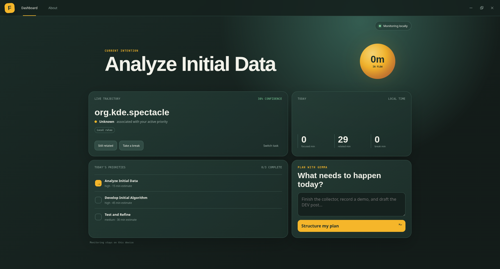
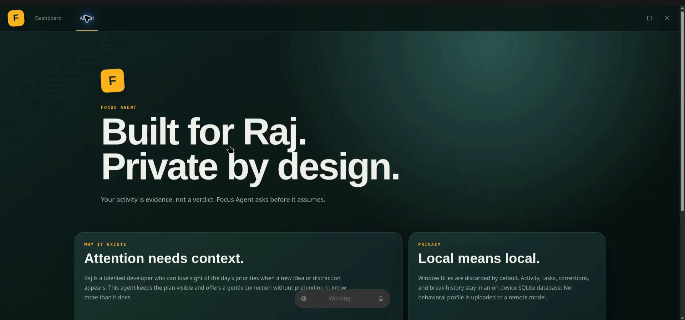
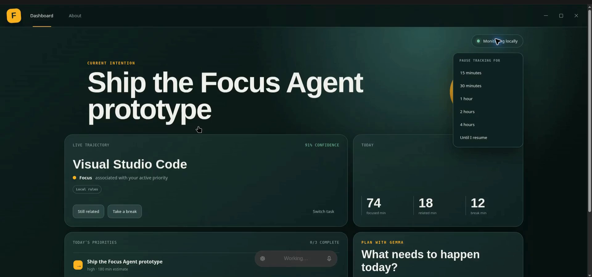
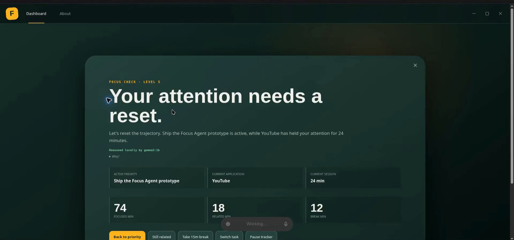
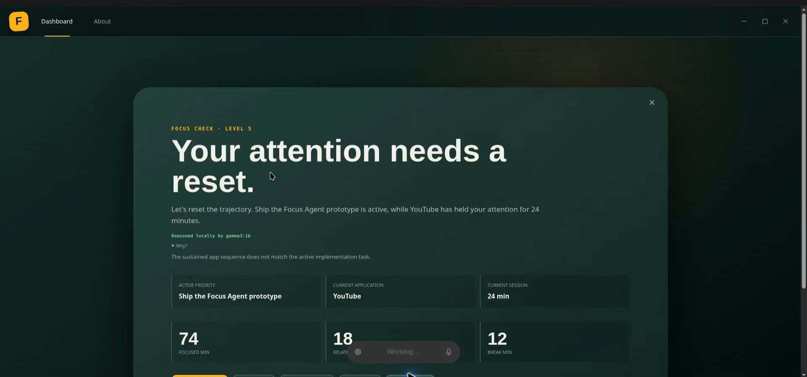
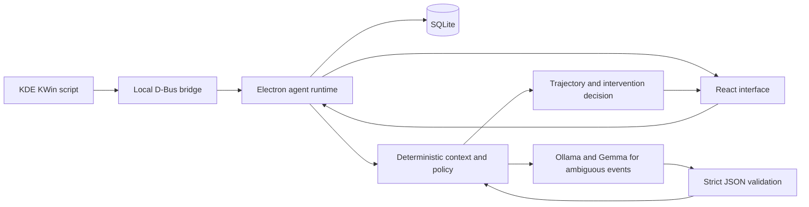

# Focus Agent

**A private, local-first execution companion built for Raj.**

Focus Agent compares what Raj intends to accomplish with lightweight evidence from his desktop activity. It keeps the current priority visible, reasons about ambiguous activity with a local Gemma model, and escalates from a gentle check-in to a full focus reset only when the evidence remains strong.

Built for the **Hacktoberfest Weekend Challenge: Build for a Friend** and the **Best Use of Gemma** category.

[Watch the captioned demo](https://drive.google.com/file/d/1r-zQqRiEFjOUE3zwqWlYkYvbjhJM1W5O/view?usp=drive_link) · [View the source](https://github.com/yasshhhraj/focusagent)



## Built for Raj

Raj is a privacy-preserving pseudonym for a real friend. He is a talented developer with ambitious plans, but interesting ideas and unexpected distractions can pull his attention away from the priority he originally chose.

Conventional task lists remember the plan but cannot tell whether execution still matches it. Conventional screen-time tools count applications but lack context. Focus Agent connects the two:

```text
Declared intention → Local activity evidence → Contextual reasoning → User-controlled action
```

The application is deliberately not a surveillance product. Activity is evidence, not a verdict, and Raj can always correct the agent.

## Demo

The [2 minute 20 second captioned walkthrough](https://drive.google.com/file/d/1r-zQqRiEFjOUE3zwqWlYkYvbjhJM1W5O/view?usp=drive_link) demonstrates:

- the focused dashboard and privacy explanation;
- natural-language planning;
- priority switching and completion confirmation;
- learned **Still related** corrections;
- intentional breaks and temporary monitoring pauses;
- progressive intervention levels; and
- inspectable Gemma reasoning.

The walkthrough uses representative preview data so the complete intervention sequence can be shown without waiting through real cooldown periods. The Electron application itself consumes live KDE KWin activity events and runs Gemma locally through Ollama.

## Product walkthrough

### Private by design



Window titles are discarded by default. Tasks, activity sessions, corrections, breaks, reasoning results, and intervention history remain in an on-device SQLite database.

### Monitoring remains optional



Raj can pause monitoring for 15 minutes, 30 minutes, 1 hour, 2 hours, 4 hours, or indefinitely until he resumes it.

### Progressive, explainable interventions



Ignored drift checks become gradually more visible. The highest level shows the active priority, current application, session duration, and essential daily statistics instead of presenting an unexplained warning.



Gemma's explanation is available through **Why?**, while deterministic application policy controls whether an intervention is allowed. Raj can return to the priority, correct the classification, take a break, switch tasks, pause monitoring, or dismiss the check.

## What works

- Converts a natural-language daily plan into up to three structured tasks.
- Selects the first installed Gemma-family model from local Ollama.
- Preserves planning through a deterministic fallback when Gemma is unavailable.
- Captures application changes from KDE KWin over local D-Bus.
- Aggregates changes into SQLite activity sessions rather than storing continuous screenshots or keystrokes.
- Sends only an allowlisted activity context to Gemma after activity remains ambiguous for five minutes.
- Strictly validates model JSON and maps `low`, `medium`, and `high` confidence to deterministic thresholds.
- Treats generic browsers as unknown unless Raj has taught the agent a task relationship.
- Remembers corrections per task and application.
- Supports task activation, completion, intentional breaks, and monitoring pauses.
- Escalates repeated ignored drift checks from a passive notification to a full-window intervention.
- Filters the Focus Agent window itself so it cannot learn a false relationship with its own UI.

## Why open-weight AI matters

Desktop activity can reveal routines, working hours, interests, and moments of distraction. Sending that behavioral history to a hosted model would undermine the product's purpose.

Gemma runs locally through Ollama, which means:

- personal activity context stays on Raj's computer;
- reasoning continues without an internet connection;
- there is no per-request inference cost;
- the model can be replaced without redesigning the product; and
- deterministic collection, tasks, breaks, and safety policies still work if the model is offline.

Gemma is not an added chatbot. It handles the semantic part of the core loop: structuring plans and interpreting ambiguous activity that application names alone cannot explain.

## Architecture



### Reasoning safety boundary

```text
Recent sessions + active task + learned corrections
                         ↓
               allowlisted local context
                         ↓
                    Gemma JSON
                         ↓
          schema validation + confidence policy
                         ↓
        deterministic intervention requirements
                         ↓
              user-visible explanation/action
```

The model never writes directly to the database and never has unrestricted authority to interrupt the user.

## Technology

| Layer | Technology |
| --- | --- |
| Desktop | Electron |
| Interface | React + TypeScript + Vite |
| Local inference | Gemma through Ollama |
| Persistence | Node's built-in SQLite |
| Linux integration | KDE Plasma 6 KWin script + D-Bus |
| Tests | Node test runner |

## Run locally

### Requirements

- Linux with KDE Plasma 6 and Wayland
- Node.js 22 or newer
- npm
- Ollama with a Gemma-family model

Install a small Gemma model:

```bash
ollama pull gemma3:1b
```

Install dependencies and start the application:

```bash
git clone https://github.com/yasshhhraj/focusagent.git
cd focusagent
npm ci
npm test
npm run dev
```

Install the KWin activity bridge while the desktop application is running:

```bash
kpackagetool6 --type=KWin/Script -i ./kwin/focus-agent
kwriteconfig6 --file kwinrc --group Plugins --key focus-agent-activityEnabled true
qdbus6 org.kde.KWin /KWin reconfigure
```

If the bridge was installed previously, replace `-i` with `-u` to update it.

## Linux release candidate

The first release candidate targets **KDE Plasma 6 on Wayland, x86_64**, and is built on Kali Linux Rolling. The AppImage includes Electron and its Node.js runtime, so a separate Node.js installation is not needed. It has not been validated on every Linux distribution or desktop environment.

The app still requires Ollama with a Gemma-family model for local AI, plus the KWin activity bridge and D-Bus integration. Download the matching `focus-agent-kwin-bridge` archive from [GitHub Releases](https://github.com/yasshhhraj/focusagent/releases), unpack it, then install and enable the script:

```bash
tar -xzf focus-agent-kwin-bridge-v0.1.0-rc.1.tar.gz
kpackagetool6 --type=KWin/Script -i ./focus-agent
kwriteconfig6 --file kwinrc --group Plugins --key focus-agent-activityEnabled true
qdbus6 org.kde.KWin /KWin reconfigure
```

Download the AppImage from [GitHub Releases](https://github.com/yasshhhraj/focusagent/releases), mark it executable, and launch it:

```bash
chmod +x Focus-Agent-0.1.0-rc.1-x86_64.AppImage
./Focus-Agent-0.1.0-rc.1-x86_64.AppImage
```

On systems without AppImage FUSE support, try `./Focus-Agent-0.1.0-rc.1-x86_64.AppImage --appimage-extract-and-run`.

## Privacy model

Focus Agent collects the minimum evidence needed for the prototype:

- application identifier;
- process ID for filtering its own windows;
- session start and end times;
- user-created tasks, corrections, breaks, and intervention responses; and
- validated local reasoning results.

It does **not** record keystrokes, screenshots, document contents, browser history, or cloud behavioral profiles. KWin supplies a window caption to the bridge, but the runtime discards it unless title capture is explicitly enabled.

## Verification

```bash
npm test
npm run build
node --check electron/main.mjs
```

The test suite covers exact activity-session targeting, self-window filtering, reasoning validation, confidence policy, and browser false-positive prevention. The implementation was also exercised with `gemma3:1b`: an obvious game launcher produced a high-confidence distraction result, while an unknown browser was safely reduced to low-confidence unknown.

## Current prototype boundaries

- KDE Plasma 6 on Wayland is the supported activity-collection target.
- Classification currently uses application-level context; browser domains and document contents are intentionally unavailable.
- The included build runs from source and is not yet distributed as an AppImage.
- Voice input, automatic login startup, long-term analytics, and configurable data retention are post-challenge work.
- The model may still make mistakes, which is why every inference is validated and user-correctable.

## Repository layout

```text
electron/           Agent runtime, SQLite, reasoning, and tests
kwin/focus-agent/   Minimal KDE activity bridge
src/                React interface and shared types
docs/screenshots/   Caption-free walkthrough frames
```

## License

Released under the [MIT License](./LICENSE).
